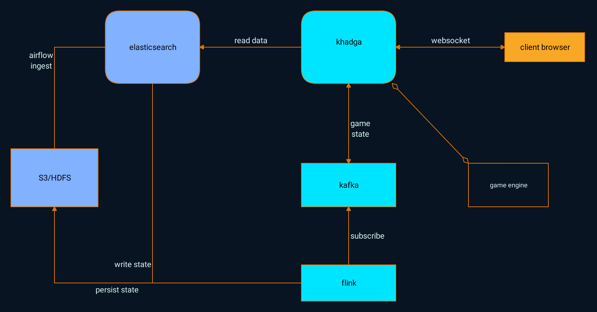

# Data for retro

Data storage and retrieval for retro will not be your standard web server backed by a database.  Instead, a more big
data approach will be taken.

At a high level we will have the following architecture

## Source of truth

The source of truth will be events archived in S3/HDFS.  We will have data from khadga (either from the game engine or
from other interaction with the browser) be sent to a topic in kafka.

## Schemas and data formats

For efficiency, we are going to store 